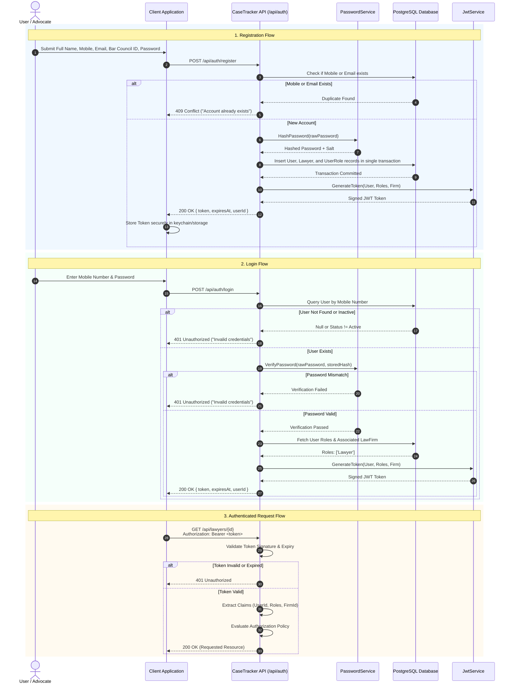

# CaseTracker — Authentication & Security Handshake

> **Document Version:** 1.1  
> **Scheme:** JSON Web Token (JWT) Bearer Authentication  
> **Algorithm:** HMAC-SHA256 (`HS256`)  
> **Hashing Algorithm:** PBKDF2 / BCrypt with Unique Salt  
> **Parent Documentation:** [Documentation Center](../README.md)

---

## 1. Authentication Architecture

CaseTracker uses **stateless token-based authentication**. Clients authenticate via credentials (Mobile Number / Email + Password) and receive a signed JWT Bearer Token, which must be presented in subsequent HTTP requests via the `Authorization: Bearer <token>` header.



---

## 2. JWT Token Structure & Claims

Every issued token contains the following cryptographically signed payload:

### Token Header
```json
{
  "alg": "HS256",
  "typ": "JWT"
}
```

### Token Payload
```json
{
  "sub": "3fa85f64-5717-4562-b3fc-2c963f66afa6",
  "nameid": "3fa85f64-5717-4562-b3fc-2c963f66afa6",
  "mobile_phone": "+919876543210",
  "email": "advocate.soorya@example.com",
  "role": "Lawyer",
  "law_firm_id": "b1b2b3b4-5717-4562-b3fc-2c963f66afa6",
  "jti": "d3b07384-d113-40e1-9d8e-0f0e0c0d0e0f",
  "iss": "CaseTracker",
  "aud": "CaseTrackerAudience",
  "exp": 1789531200,
  "iat": 1789527600
}
```

---

## 3. Password Security Standard

* Passwords must be at least **8 characters long** and contain at least one uppercase letter, one lowercase letter, one digit, and one special character.
* Plaintext passwords are **never stored or logged**.
* Hashing utilizes PBKDF2 with HMAC-SHA256 (or BCrypt) using a cryptographically secure randomly generated salt.
