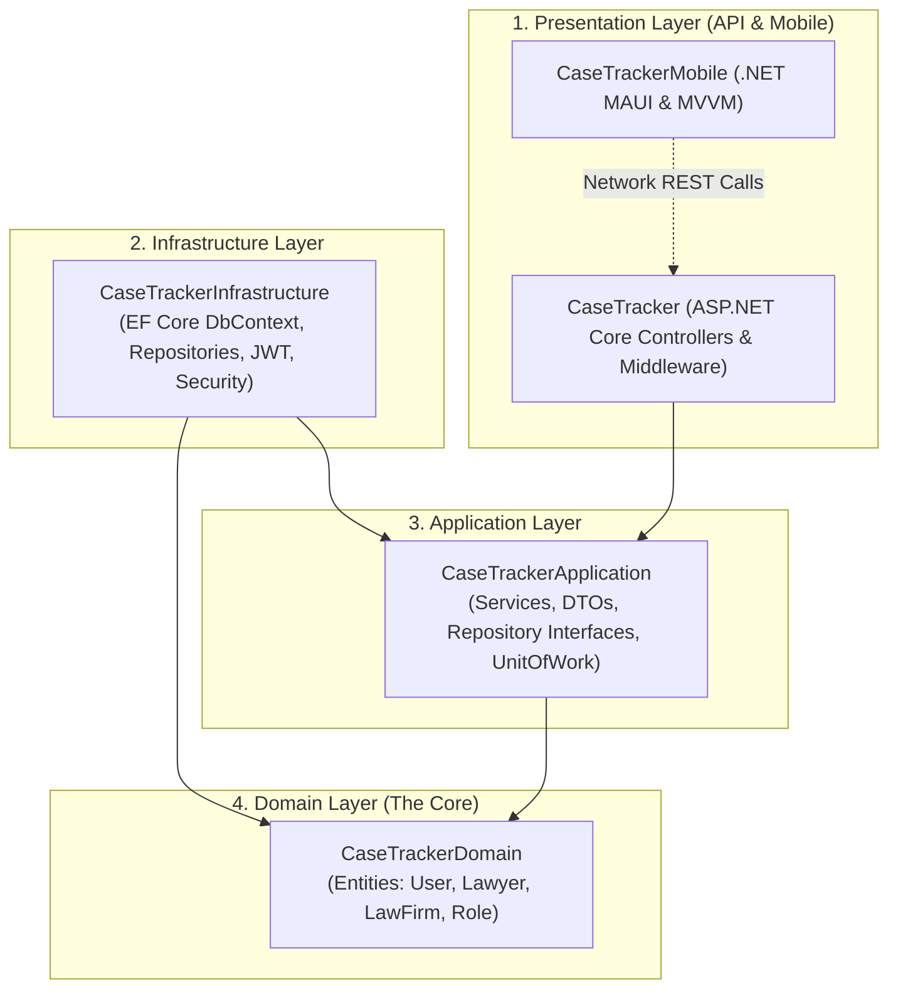
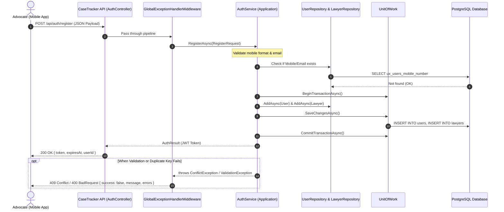

# CaseTracker — System Architecture & Layering

> **Document Version:** 1.0  
> **Pattern:** Clean Architecture (Onion / Hexagonal Architecture)  
> **Status:** Approved Baseline  
> **Parent Documentation:** [Documentation Center](../README.md)

---

## 1. Architectural Philosophy

CaseTracker adheres to **Clean Architecture** (Dependency Inversion Principle). 
The core rule is: **Dependencies flow strictly inward.**
* Outer layers know about inner layers.
* Inner layers (such as Domain and Application) have **zero knowledge** of UI frameworks, database engines, or web protocols.

---

## 2. Layer-by-Layer Responsibilities

### 2.1 Domain Layer (`CaseTrackerDomain`)
* **Purpose**: Represents the core business models and state of the legal domain.
* **Dependencies**: Completely standalone. No references to EF Core, ASP.NET Core, or third-party libraries.
* **Key Components**:
  * Core entities: [`User`](file:///D:/CaseTracker/Backend/CaseTrackerDomain/Models/User.cs), [`Lawyer`](file:///D:/CaseTracker/Backend/CaseTrackerDomain/Models/Lawyer.cs), [`LawFirm`](file:///D:/CaseTracker/Backend/CaseTrackerDomain/Models/LawFirm.cs), [`Role`](file:///D:/CaseTracker/Backend/CaseTrackerDomain/Models/Role.cs), [`UserRole`](file:///D:/CaseTracker/Backend/CaseTrackerDomain/Models/UserRole.cs), [`UserLawFirm`](file:///D:/CaseTracker/Backend/CaseTrackerDomain/Models/UserLawFirm.cs).
  * Standardized audit fields: `CreatedAt`, `UpdatedAt`, `CreatedBy`, `UpdatedBy`.

### 2.2 Application Layer (`CaseTrackerApplication`)
* **Purpose**: Orchestrates use cases and encapsulates business workflow rules.
* **Dependencies**: References only `CaseTrackerDomain`.
* **Key Components**:
  * **DTOs**: Encapsulate incoming requests (`RegisterRequest`, `LoginRequest`) and outbound responses (`AuthResult`, `ApiResponse`).
  * **Interfaces**: Decoupled repository contracts (`IUserRepository`, `ILawyerRepository`), Unit of Work (`IUnitOfWork`), and service contracts (`IAuthService`, `IJwtService`, `IPasswordService`).
  * **Business Services**: Concrete implementation of workflows (`AuthService`, `LawyerService`, `LawFirmService`).
  * **Custom Exceptions**: Domain-specific exceptions (`ValidationException`, `NotFoundException`, `ConflictException`, `UnauthorizedException`).

### 2.3 Infrastructure Layer (`CaseTrackerInfrastructure`)
* **Purpose**: Encapsulates external I/O concerns, database access, and cryptographic algorithms.
* **Dependencies**: References `CaseTrackerApplication` and `CaseTrackerDomain`.
* **Key Components**:
  * **Data Access**: [`ApplicationDbContext`](file:///D:/CaseTracker/Backend/CaseTrackerInfrastructure/Data/ApplicationDbContext.cs) with PostgreSQL table configurations and index constraints.
  * **Repositories**: Concrete data access classes inheriting from generic `Repository<T>`.
  * **Transactions**: `UnitOfWork` for transactional consistency across multiple repository operations.
  * **Security**: Password hashing and token generation in `PasswordService` and `JwtService`.

### 2.4 Presentation Layer (`CaseTracker` Web API)
* **Purpose**: Exposes REST endpoints, parses HTTP payloads, handles authentication tokens, and transforms exceptions into clean responses.
* **Dependencies**: References `CaseTrackerApplication` and `CaseTrackerInfrastructure`.
* **Key Components**:
  * **Controllers**: Lean, delegating endpoints (`AuthController`, `LawyerController`, `LawFirmController`).
  * **Middleware**: `GlobalExceptionHandlerMiddleware` catches all exceptions and normalizes error payloads.
  * **Extensions**: Clean modular service registration (`ApplicationServiceExtensions`, `InfrastructureServiceExtensions`, `AuthenticationServiceExtensions`).

### 2.5 Mobile Client (`CaseTrackerMobile`)
* **Purpose**: Cross-platform advocate client on iOS, Android, and Windows.
* **Dependencies**: References `CaseTrackerApplication` for DTO reuse. Communicates with `CaseTracker` over HTTPS REST APIs.

---

## 3. End-to-End Request Lifecycle

The diagram below details the sequence of a typical authenticated request (e.g., advocate registration or case query):

