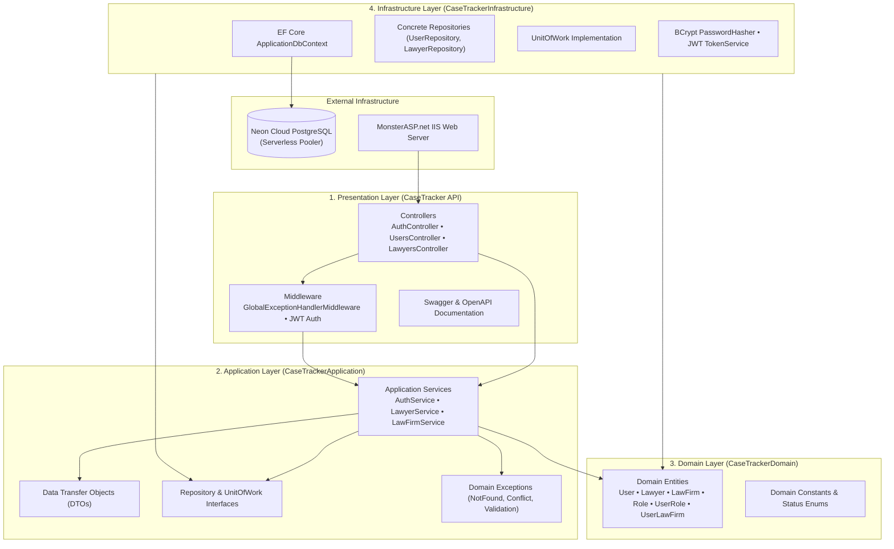
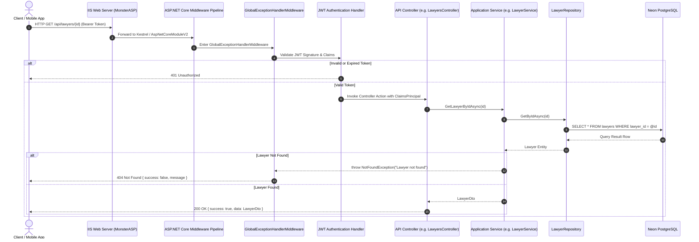

# CaseTracker — System Architecture & Clean Layering

> **Document Version:** 1.2  
> **Framework:** ASP.NET Core (.NET 10)  
> **Pattern:** Clean Architecture (Onion / Hexagonal Architecture)  
> **Status:** Active Baseline  
> **Parent Documentation:** [Documentation Center](../README.md)

---

## 1. Architectural Philosophy

CaseTracker is structured according to the principles of **Clean Architecture** (Robert C. Martin) and the **Dependency Inversion Principle**:

* **Dependencies flow strictly inward**: Outer layers depend on inner layers; inner layers never depend on outer layers.
* **Domain Independence**: The Domain Layer (`CaseTrackerDomain`) and Application Layer (`CaseTrackerApplication`) are completely decoupled from concrete frameworks, web servers, databases, and UI implementations.
* **Separation of Concerns**: Business validation, database persistence, HTTP presentation, and external service gateways are isolated in distinct project assemblies.

---

## 2. Project Assemblies & Responsibilities

### 2.1 `CaseTrackerDomain` (Domain Core)
* **Zero External Dependencies**: Pure C# class library.
* **Contains**:
  * Core entity definitions with navigation properties.
  * Audit fields (`CreatedAt`, `UpdatedAt`, `CreatedBy`, `UpdatedBy`).
  * Enforces state consistency across aggregate roots.

### 2.2 `CaseTrackerApplication` (Use Cases & Business Logic)
* **Dependencies**: References `CaseTrackerDomain` only.
* **Contains**:
  * **DTOs**: Request and response payloads (e.g. `RegisterRequest`, `LoginRequest`, `AuthResult`, `ApiResponse<T>`).
  * **Contracts**: `IUserRepository`, `ILawyerRepository`, `ILawFirmRepository`, `IRoleRepository`, `IUnitOfWork`, `IAuthService`, `IJwtService`, `IPasswordService`.
  * **Business Workflows**: Multi-step operations like lawyer registration, role assignment, and validation checks.
  * **Exceptions**: Custom domain exceptions mapped to HTTP response codes.

### 2.3 `CaseTrackerInfrastructure` (Data Access & Security)
* **Dependencies**: References `CaseTrackerApplication` and `CaseTrackerDomain`.
* **Contains**:
  * **`ApplicationDbContext`**: Configures PostgreSQL tables, schemas, relations, indexes, and seed data.
  * **Repositories**: Generic `Repository<T>` and specialized repositories implementing application contracts.
  * **`UnitOfWork`**: Manages EF Core database transactions (`BeginTransactionAsync`, `CommitTransactionAsync`, `RollbackTransactionAsync`).
  * **Security**: Concrete password hashing and JWT token issuance.

### 2.4 `CaseTracker` (Presentation Web API)
* **Dependencies**: References `CaseTrackerApplication` and `CaseTrackerInfrastructure`.
* **Contains**:
  * **Controllers**: Exposes REST endpoints (`/api/auth`, `/api/lawyers`, `/api/version`, etc.).
  * **Middleware**: `GlobalExceptionHandlerMiddleware` captures all unhandled exceptions and outputs consistent RFC-compliant JSON responses.
  * **Service Registration**: Clean extension methods in `Extensions/` for dependency injection.

---

## 3. End-to-End Request Execution Pipeline

The flowchart below demonstrates the path of an HTTP request through the system:

---

## 4. Error Handling Strategy

All system exceptions are processed centrally by [`GlobalExceptionHandlerMiddleware`](file:///d:/ProjectApp/CaseTracker/CaseTracker/Middleware/GlobalExceptionHandlerMiddleware.cs):

| Exception Type | HTTP Status | Response Schema |
| :--- | :---: | :--- |
| `ValidationException` | `400 Bad Request` | `{ success: false, message: "Validation failed", errors: [...] }` |
| `UnauthorizedAccessException` / `UnauthorizedException` | `401 Unauthorized` | `{ success: false, message: "Unauthorized" }` |
| `KeyNotFoundException` / `NotFoundException` | `404 Not Found` | `{ success: false, message: "Resource not found" }` |
| `InvalidOperationException` / `ConflictException` | `409 Conflict` | `{ success: false, message: "Conflict occurred" }` |
| Unhandled Exceptions | `500 Internal Server Error` | `{ success: false, message: "An unexpected error occurred" }` |

This prevents stack traces and database internal details from ever leaking to the client in production.
