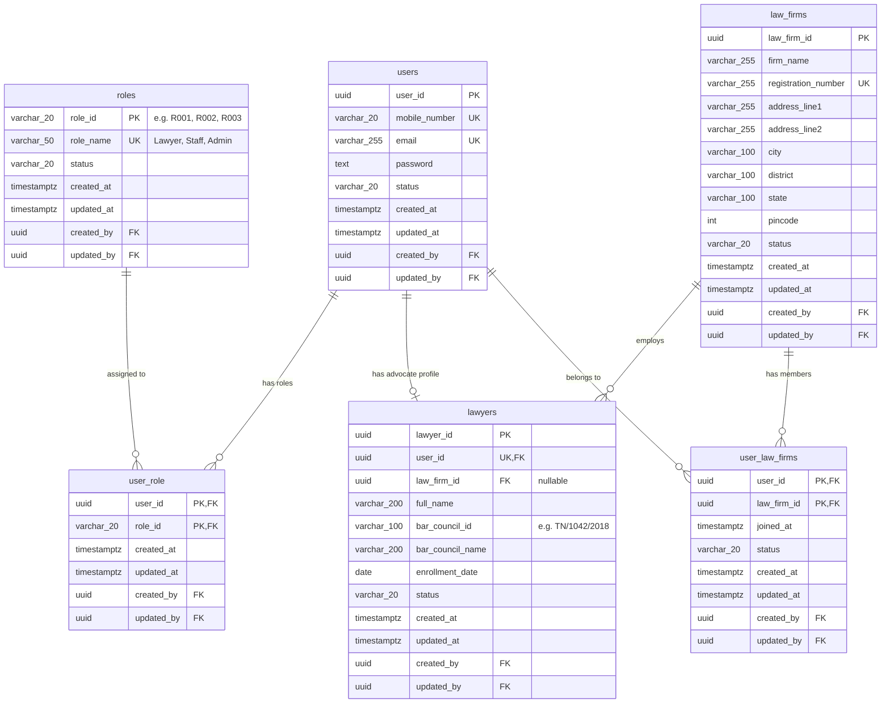

# CaseTracker — Database Architecture & Data Models

> **Document Version:** 1.1  
> **Database Engine:** PostgreSQL 16+  
> **Tenancy Strategy:** Shared-Table Architecture with Logical Isolation  
> **Parent Documentation:** [Documentation Center](../README.md)

---

## 1. Multi-Tenancy Architecture

CaseTracker utilizes a **Shared-Table, Shared-Schema Architecture** in PostgreSQL.

* All organizations (law firms, independent advocates, and legal staff) share the same underlying schema tables (`users`, `lawyers`, `law_firms`, etc.).
* Logical tenant isolation is enforced at the **application and query layer** using foreign keys (`law_firm_id`, `created_by`, `user_id`).
* **Benefits**:
  * Simplified schema migrations across all tenants via EF Core.
  * Optimal connection pooling and resource utilization.
  * Centralized backups, vacuuming, indexing, and health monitoring.
  * Ready foundation for future PostgreSQL Row-Level Security (RLS) policies if hard database-level multi-tenancy is required.

---

## 2. Entity-Relationship Diagram (ERD)

The diagram below reflects the production database schema defined in [`ApplicationDbContext.cs`](file:///D:/CaseTracker/Backend/CaseTrackerInfrastructure/Data/ApplicationDbContext.cs):

---

## 3. Database Indexes & Constraints

To maintain sub-millisecond query performance and guarantee data integrity, the following indexes and constraints are enforced:

### Unique Constraints (`UX`)
* `ux_users_mobile_number`: Enforces unique mobile numbers across all users.
* `ux_users_email`: Enforces unique emails across all users.
* `ux_roles_role_name`: Enforces unique role names (`Lawyer`, `Staff`, `Admin`).
* `ux_law_firms_registration_number`: Enforces unique firm registration identifiers.

### Performance Indexes (`IX`)
* `ix_lawyers_user_id`: Unique index ensuring 1-to-1 relationship between User and Lawyer.
* `ix_lawyers_bar_council_id`: Fast advocate search by Bar Council enrollment (e.g., `TN/1042/2018`).
* `ix_users_status` & `ix_lawyers_status`: Filtered scans for active accounts.

### Cascade & Restriction Rules
* **User &rarr; Lawyer**: `DeleteBehavior.Cascade`. Deleting an account removes the corresponding advocate profile.
* **Law Firm &rarr; Lawyer**: `DeleteBehavior.SetNull`. Deleting or de-registering a law firm keeps the advocate profile intact as an unassigned independent practitioner.
* **Role &rarr; UserRole**: `DeleteBehavior.Restrict`. System roles cannot be deleted while assigned to existing active users.
* **Audit Fields**: All self-referential audit relationships (`CreatedBy`, `UpdatedBy`) use `DeleteBehavior.Restrict` to protect historical audit trails.

---

## 4. Default Seed Data

Configured via `ApplicationDbContext.OnModelCreating`:
* **R001**: `Lawyer` (Default role for independent advocates)
* **R002**: `Staff` (Legal clerks and junior associates)
* **R003**: `Admin` (Law-firm partners and administrators)

