# CaseTracker — CI/CD Pipeline & Automated Deployment Guide

> **Document Version:** 1.0  
> **Target Hosting:** MonsterASP.net (IIS 10.0 / .NET 10 x86/AnyCPU)  
> **Orchestrator:** GitHub Actions  
> **Status:** Production Automated  
> **Parent Documentation:** [Documentation Center](../README.md)

---

## 1. Overview & Architecture

CaseTracker uses a two-stage automated **Continuous Integration (CI)** and **Continuous Deployment (CD)** pipeline using GitHub-hosted Windows runners (`windows-latest`).

```mermaid
flowchart TD
    subgraph DeveloperEnvironment ["Developer Workspace"]
        BranchDev["Feature Branch: dev/soorya"]
        CommitDev["Local Commits & Build Verification"]
        PushDev["git push origin dev/soorya"]
        CreatePR["Create Pull Request: dev/soorya -> master"]
    end

    subgraph CI_Pipeline ["Continuous Integration (.github/workflows/ci.yml)"]
        TriggerCI["Trigger: on pull_request to master"]
        CheckoutCI["actions/checkout@v4"]
        SetupDotNetCI["actions/setup-dotnet@v4 (.NET 10.0.x)"]
        RestoreCI["dotnet restore CaseTracker.slnx"]
        BuildCI["dotnet build CaseTracker.slnx --configuration Release --no-restore"]
        PassValidation{"Build Succeeded?"}
        BlockPR["Block Merge"]
        AllowMerge["Allow Merge to master"]
    end

    subgraph CD_Pipeline ["Continuous Deployment (.github/workflows/cd.yml)"]
        TriggerCD["Trigger: on push to master / workflow_dispatch"]
        CheckoutCD["actions/checkout@v4"]
        SetupDotNetCD["actions/setup-dotnet@v4 (.NET 10.0.x)"]
        RestoreCD["dotnet restore CaseTracker.slnx"]
        BuildCD["dotnet build CaseTracker.slnx --configuration Release --no-restore"]
        PublishCD["dotnet publish CaseTracker/CaseTracker.csproj --configuration Release --no-build --output ./publish"]
        CredentialResolution["Resolve Credentials: GitHub Secrets OR .env fallback"]
        FindMSDeploy["Locate msdeploy.exe on Runner"]
        FormatArguments["Construct Arguments via PowerShell Array (Avoid Quoting Bug)"]
        ExecuteDeploy["Invoke msdeploy.exe with AppOffline & WMSvc endpoint"]
        DeploySuccess{"Exit Code == 0?"}
        DeployFail["Report Exit Code & Troubleshooting Guide"]
        DeployComplete["Site Live at http://zylocorp.runasp.net"]
    end

    BranchDev --> CommitDev --> PushDev --> CreatePR
    CreatePR --> TriggerCI
    TriggerCI --> CheckoutCI --> SetupDotNetCI --> RestoreCI --> BuildCI --> PassValidation
    PassValidation -- No --> BlockPR
    PassValidation -- Yes --> AllowMerge
    AllowMerge --> TriggerCD
    TriggerCD --> CheckoutCD --> SetupDotNetCD --> RestoreCD --> BuildCD --> PublishCD
    PublishCD --> CredentialResolution --> FindMSDeploy --> FormatArguments --> ExecuteDeploy --> DeploySuccess
    DeploySuccess -- No --> DeployFail
    DeploySuccess -- Yes --> DeployComplete
```



---

## 2. CI Workflow (`ci.yml`)

The Continuous Integration workflow acts as the quality gate for the repository. Every pull request targeting the `master` branch triggers this workflow.

* **Trigger**: 
  - `pull_request` on branch `master`
  - `workflow_dispatch` (manual trigger)
* **Runner**: `windows-latest`
* **Key Tasks**:
  1. Checks out branch repository code.
  2. Provisions .NET 10 SDK environment.
  3. Restores dependencies across all 4 solution projects (`CaseTrackerDomain`, `CaseTrackerApplication`, `CaseTrackerInfrastructure`, `CaseTracker`).
  4. Performs a full `Release` build to catch syntax, type, and compiler warnings.

---

## 3. CD Workflow (`cd.yml`)

The Continuous Deployment workflow automatically deploys the compiled ASP.NET Core application to the **MonsterASP.net** production environment.

### Workflow Triggers
```yaml
on:
  push:
    branches:
      - master
  workflow_dispatch:
```

### Key Execution Steps
1. **Compilation & Packaging**:
   ```bash
   dotnet publish CaseTracker/CaseTracker.csproj --configuration Release --no-build --output ./publish
   ```
2. **Credential Resolution Matrix**:
   The workflow checks both standard GitHub Repository Secrets naming styles, and falls back to a `.env` file if secrets are omitted:
   ```powershell
   $server = if (-not [string]::IsNullOrWhiteSpace($env:SECRET_SERVER)) { 
       $env:SECRET_SERVER 
   } else { 
       (Get-Item env:SERVER_COMPUTER_NAME, env:WEBDEPLOY_SERVER -ErrorAction SilentlyContinue | Select-Object -First 1).Value 
   }
   ```
3. **Endpoint Normalization**:
   Cleanses the input URL to construct the exact Microsoft Web Management Service (WMSvc) endpoint:
   ```powershell
   $destComputer = "https://${cleanHost}:8172/msdeploy.axd?site=${site}"
   ```
4. **MSDeploy Execution**:
   Uses PowerShell array splatting (`$msdeployArgs`) to prevent Windows argument parser quoting corruptions:
   ```powershell
   $destArg = "contentPath=${site},computerName=${destComputer},userName=${username},password=${password},authtype=Basic,includeAcls=False"

   $msdeployArgs = @(
       "-verb:sync",
       "-source:contentPath=$publishPath",
       "-dest:$destArg",
       "-enableRule:AppOffline",
       "-allowUntrusted",
       "-disableLink:AppPoolExtension",
       "-disableLink:ContentExtension",
       "-disableLink:CertificateExtension",
       "-retryAttempts:5",
       "-retryInterval:3000"
   )

   & $msdeployPath $msdeployArgs
   ```

---

## 4. Required Secrets & Configuration

### GitHub Repository Secrets
Navigate to **Settings &rarr; Secrets and variables &rarr; Actions** in your GitHub repository and define:

| Secret Name | Value | Description |
| :--- | :--- | :--- |
| `WEBSITE_NAME` | `site90440` | Your MonsterASP website identifier |
| `SERVER_COMPUTER_NAME` | `https://site90440.siteasp.net:8172` | WMSvc endpoint host |
| `SERVER_USERNAME` | `site90440` | WebDeploy / FTP username |
| `SERVER_PASSWORD` | `6Te#=9KjBd3-` | WebDeploy password from Visual Studio access |

*(Note: The workflow also recognizes `WEBDEPLOY_SERVER`, `WEBDEPLOY_SITE`, `WEBDEPLOY_USERNAME`, and `WEBDEPLOY_PASSWORD`).*

### Optional `.env` File Fallback
If secrets are not configured in GitHub, the workflow automatically parses a `.env` file in the repository root:
```env
WEBSITE_NAME=site90440
SERVER_COMPUTER_NAME=https://site90440.siteasp.net:8172
SERVER_USERNAME=site90440
SERVER_PASSWORD=6Te#=9KjBd3-
```

---

## 5. Critical Troubleshooting & Gotchas

### Issue 1: `(401) Unauthorized`
* **Root Cause**: On MonsterASP.net, WebDeploy on port 8172 has a **different password** from the FTP password and must be explicitly enabled.
* **Resolution**:
  1. Log into your [MonsterASP Control Panel](https://admin.monsterasp.net/).
  2. Open your website (`site90440`).
  3. Click the **`</> Visual Studio access`** tab (next to `FTP/SFTP access`).
  4. Ensure WebDeploy is **Enabled**.
  5. Copy the password shown under Visual Studio access (`6Te#=9KjBd3-`) and update your GitHub secret `SERVER_PASSWORD`.

### Issue 2: `Error: Unrecognized argument '"-dest:..."'. All arguments must begin with "-"`
* **Root Cause**: In PowerShell, passing embedded double quotes inside an argument token (e.g. `-dest:iisApp="$site",...`) causes PowerShell to wrap the entire parameter in escaped outer quotes (`"-dest:..."`), which MSDeploy rejects.
* **Resolution**: Pass arguments as an array `@(...)` and avoid literal inner quotes. The updated `cd.yml` handles this automatically.

### Issue 3: `System.IO.IOException: The process cannot access the file because it is being used by another process`
* **Root Cause**: IIS has locked active `.dll` files in memory while handling user traffic.
* **Resolution**: Use `-enableRule:AppOffline`. This places a temporary `app_offline.htm` in the website root before synchronization, releasing all file handles, and removes it once upload finishes.

---

## 6. How to Test Promotion from `dev/soorya` to `master`

1. **Commit and Push Changes to `dev/soorya`**:
   ```bash
   git checkout dev/soorya
   git add .
   git commit -m "feat: your feature commit"
   git push origin dev/soorya
   ```
2. **Open Pull Request**:
   - Open PR on GitHub: `dev/soorya` &rarr; `master`.
   - Verify that **CI Build** runs and passes green.
3. **Merge Pull Request**:
   - Click **Merge Pull Request**.
   - Watch **CD Deployment** trigger automatically on GitHub Actions.
4. **Verify Deployment**:
   - Check version endpoint: [http://zylocorp.runasp.net/api/version](http://zylocorp.runasp.net/api/version)
   - Inspect Swagger documentation: [http://zylocorp.runasp.net/swagger](http://zylocorp.runasp.net/swagger)
