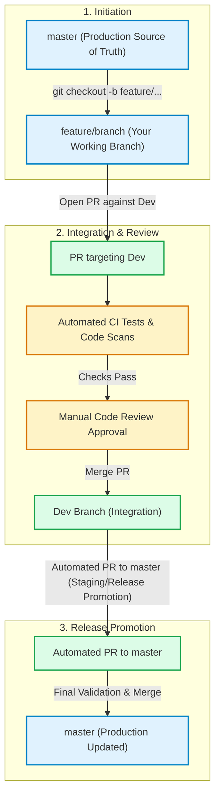

# Contributing Guidelines

Thank you for contributing to CaseTracker! To maintain code quality, stability, and a reliable release lifecycle, all contributors must strictly adhere to the branching strategy and Pull Request (PR) workflow detailed below.

---

## 1. Branching Strategy & Core Rules

### 1. Always Branch from `master`
All new feature branches, bug fixes, enhancements, and chore tasks **must be created directly from the latest `master` branch**.
* Do not branch off `Dev` or other unreleased feature branches unless explicitly instructed.
* Always ensure your local `master` is synchronized before creating a new branch:
  ```bash
  git checkout master
  git pull origin master
  git checkout -b feature/your-feature-name
  ```

### 2. Direct Pushing is Forbidden
* **Pushing directly to `master` is strictly forbidden.**
* **Pushing directly to `Dev` is strictly forbidden.**
* Both `master` and `Dev` are protected branches. All changes must arrive via reviewed Pull Requests.

### 3. All Pull Requests Must Target `Dev`
* When your work is complete and tested, open a Pull Request targeting the **`Dev`** branch (`base: Dev` $\leftarrow$ `compare: feature/your-feature-name`).
* **Never** open a feature PR directly against `master`.

### 4. CI Gates: Automated Tests & Manual Approval
Opening or updating a PR against `Dev` automatically triggers the continuous integration pipeline:
* **Automated Testing & Builds** (scope in future) : Unit tests, linting, and build checks run automatically. All automated checks must pass green.
* **Code Suggestions**: Any automated code quality/security scan suggestions or bot comments must be resolved.
* **Manual Review & Approval**: Merging into `Dev` requires at least one manual review approval from Repo Owner | Balaji.

---

## 2. Workflow Visualization

The following diagram illustrates the complete lifecycle from feature creation to production deployment:



---

## 3. Step-by-Step Contribution Guide

### Step 1: Sync and Create Feature Branch
```bash
git checkout master
git pull origin master
git checkout -b feature/case-search-filter
```
> **Branch Naming Conventions**:
> - `feature/<feature-name>` for new capabilities
> - `fix/<bug-description>` for bug fixes
> - `refactor/<scope>` for code cleanup
> - `docs/<topic>` for documentation updates

### Step 2: Implement Changes & Write Unit Tests
Write clean, maintainable code following project standards. Add or update unit tests to validate your logic.

### Step 3: Verify Locally
Run local builds and tests before pushing:
```bash
dotnet build
dotnet test
```

### Step 4: Push to Your Remote Feature Branch
```bash
git add .
git commit -m "feat(case-search): add multi-tenant filter support"
git push origin feature/case-search-filter
```

### Step 5: Open a Pull Request Against `Dev`
1. Navigate to GitHub and open a new Pull Request.
2. Select **Base: `Dev`** and **Compare: `feature/case-search-filter`**.
3. Fill out the PR template completely and check off every item in the **Pre-Merge Checklist**.
4. Monitor the CI pipeline results.
5. Request review and resolve any review feedback promptly.

