# CaseTracker — Database Architecture & ER Diagram

> **Document Version:** 2.0  
> **Database Engine:** PostgreSQL 16+ (Neon Cloud Serverless with PgBouncer Pooling)  
> **Tenancy Strategy:** Shared-Table Architecture with Logical Organization Isolation  
> **Parent Documentation:** [Documentation Center](../README.md)

---

## 1. Tenancy Strategy & Architecture

CaseTracker utilizes a **Shared-Table, Shared-Schema Architecture** in PostgreSQL.

* All organizations (law firms, independent advocates, clients, and legal staff) share the same underlying schema tables (`users`, `lawyers`, `law_firms`, `clients`, `cases`, `case_hearings`, etc.).
* Logical tenant isolation is enforced at the **application and query layer** using foreign keys (`law_firm_id`, `created_by`, `user_id`).
* **Cloud Infrastructure**: Hosted on **Neon.tech Serverless PostgreSQL** using pooled connection endpoints (`ep-dry-silence-aepi0j4w-pooler.c-2.us-east-2.aws.neon.tech`) with `SSL Mode=VerifyFull; Channel Binding=Require;` for secure TLS transmission.
* **Benefits**:
  * **Zero Idle Cost & Fast Scaling**: Serverless compute automatically scales down during off-peak hours and bursts during busy morning court hours.
  * **Unified Migrations**: EF Core migrations apply instantaneously across all tenants in a single schema update.
  * **Optimized Connection Pooling**: PgBouncer integration handles thousands of concurrent short-lived API requests without exhausting database thread limits.

---

## 2. Entity-Relationship Diagram (ERD)

The diagram below reflects the production database schema covering Identity, Law Firms, Courts, Clients, Cases, Hearings, eCourts Integration, and Case Documents:

```mermaid
erDiagram
    users ||--o{ user_role : "assigned roles"
    roles ||--o{ user_role : "role memberships"
    users ||--o| lawyers : "advocate profile (1:1)"
    law_firms ||--o{ lawyers : "firm association (0..*)"
    users ||--o{ user_law_firms : "organization associations"
    law_firms ||--o{ user_law_firms : "organization members"

    law_firms ||--o{ clients : "retains (0..*)"
    law_firms ||--o{ cases : "manages (0..*)"
    courts ||--o{ cases : "adjudicated in"

    cases ||--o{ case_lawyers : "assigned advocates"
    lawyers ||--o{ case_lawyers : "represents in"

    cases ||--o{ case_clients : "litigant parties"
    clients ||--o{ case_clients : "represented in"

    cases ||--o{ case_hearings : "hearing schedule & history"
    cases ||--o{ case_orders : "interim & final orders"
    cases ||--o{ ecourt_sync_logs : "sync telemetry"
    cases ||--o{ case_documents : "legal filings & evidence"
    case_hearings ||--o{ case_documents : "documents tendered in hearing"
    case_hearings ||--o{ case_orders : "order passed on date"

    users {
        uuid user_id PK "Default: gen_random_uuid()"
        varchar_20 mobile_number UK "Indexed, Not Null"
        varchar_255 email UK "Indexed, Not Null"
        text password "PBKDF2/BCrypt Hash, Not Null"
        varchar_20 status "Default: 'Active'"
        timestamptz created_at "Default: NOW()"
        timestamptz updated_at "Default: NOW()"
        uuid created_by FK "References users.user_id"
        uuid updated_by FK "References users.user_id"
    }

    roles {
        varchar_20 role_id PK "R001: Lawyer, R002: Staff, R003: Admin"
        varchar_50 role_name UK "Lawyer, Staff, Admin"
        varchar_20 status "Default: 'Active'"
        timestamptz created_at "Default: NOW()"
        timestamptz updated_at "Default: NOW()"
    }

    user_role {
        uuid user_id PK, FK "Composite PK 1, References users"
        varchar_20 role_id PK, FK "Composite PK 2, References roles"
        timestamptz created_at "Default: NOW()"
        timestamptz updated_at "Default: NOW()"
    }

    lawyers {
        uuid lawyer_id PK "Default: gen_random_uuid()"
        uuid user_id UK, FK "1:1 with users.user_id"
        uuid law_firm_id FK "Nullable (Solo Advocate)"
        varchar_200 full_name "Not Null"
        varchar_100 bar_council_id "e.g. TN/1042/2018"
        varchar_200 bar_council_name "e.g. Bar Council of Tamil Nadu"
        date enrollment_date "Date of Bar Enrollment"
        varchar_20 status "Default: 'Active'"
        timestamptz created_at "Default: NOW()"
        timestamptz updated_at "Default: NOW()"
    }

    law_firms {
        uuid law_firm_id PK "Default: gen_random_uuid()"
        varchar_255 firm_name "Not Null"
        varchar_255 registration_number UK "Bar Council / LLP Reg"
        varchar_255 address_line1 "Street / Chamber Address"
        varchar_255 address_line2 "Suite / Floor"
        varchar_100 city "City / Town"
        varchar_100 district "District"
        varchar_100 state "State / UT"
        int pincode "Postal Code"
        varchar_20 status "Default: 'Active'"
        timestamptz created_at "Default: NOW()"
        timestamptz updated_at "Default: NOW()"
    }

    clients {
        uuid client_id PK "Default: gen_random_uuid()"
        uuid law_firm_id FK "Tenant Law Firm / null for Solo"
        varchar_20 client_type "Individual, Corporate, Partnership, Trust, Government"
        varchar_200 full_name "Client Name / Company Name"
        varchar_20 primary_phone "Indexed, Not Null"
        varchar_20 secondary_phone "Alternate Contact"
        varchar_255 email "Indexed for notifications"
        varchar_255 address_line1 "Physical Address"
        varchar_255 address_line2 "Suite / Floor"
        varchar_100 city "City"
        varchar_100 state "State"
        int pincode "Postal PIN Code"
        varchar_200 contact_person "Authorized Signatory (Corporate)"
        varchar_50 gst_number "Tax Registration ID"
        varchar_20 pan_number "PAN for Verification"
        varchar_20 status "Default: 'Active'"
        timestamptz created_at "Default: NOW()"
        timestamptz updated_at "Default: NOW()"
        uuid created_by FK "References users.user_id"
        uuid updated_by FK "References users.user_id"
    }

    cases {
        uuid case_id PK "Default: gen_random_uuid()"
        uuid law_firm_id FK "Tenant Law Firm / null for Solo"
        uuid court_id FK "References courts.court_id"
        varchar_16 cnr_number UK "16-character eCourts Unique ID"
        varchar_100 case_number "Indexed: e.g. WP/12345/2024"
        varchar_50 case_type "Indexed: Writ Petition, Suit, Criminal OP, Bail"
        varchar_100 filing_number "Registry E-Filing ID"
        date filing_date "Date matter filed in registry"
        varchar_100 registration_number "Official Court Register Docket No"
        date registration_date "Date admitted on docket"
        varchar_300 case_title "Synthesized: Petitioner vs Respondent"
        varchar_50 case_stage "Admission, Notice, Counter, Arguments, Orders"
        varchar_30 case_status "Indexed: Pending, Disposed, Stayed, Transferred"
        text acts_sections "e.g. IPC 302, NI Act 138, CPC O-39"
        varchar_100 police_station "Jurisdictional Police Station"
        varchar_50 fir_number "Crime / FIR No"
        int fir_year "FIR Filing Year"
        boolean is_ecourt_synced "Default: false"
        timestamptz last_synced_at "Last eCourts Sync Timestamp"
        varchar_20 status "Default: 'Active'"
        timestamptz created_at "Default: NOW()"
        timestamptz updated_at "Default: NOW()"
        uuid created_by FK "References users.user_id"
        uuid updated_by FK "References users.user_id"
    }

    case_clients {
        uuid case_id PK, FK "Composite PK 1, References cases"
        uuid client_id PK, FK "Composite PK 2, References clients"
        varchar_50 party_type "Petitioner, Respondent, Appellant, Defendant, Accused, Complainant"
        int party_sequence "Default: 1 (1st Petitioner, 2nd Respondent)"
        boolean is_primary "Default: true (Lead Litigant)"
        varchar_20 status "Default: 'Active'"
        timestamptz created_at "Default: NOW()"
        timestamptz updated_at "Default: NOW()"
        uuid created_by FK "References users.user_id"
        uuid updated_by FK "References users.user_id"
    }

    case_lawyers {
        uuid case_id PK, FK "Composite PK 1, References cases"
        uuid lawyer_id PK, FK "Composite PK 2, References lawyers"
        varchar_20 lawyer_role_id FK "CLR001: Lead, CLR002: Associate, CLR003: Junior"
        varchar_20 status "Default: 'Active'"
        timestamptz assigned_at "Default: NOW()"
        uuid created_by FK "References users.user_id"
        uuid updated_by FK "References users.user_id"
    }

    case_hearings {
        uuid hearing_id PK "Default: gen_random_uuid()"
        uuid case_id FK "Indexed, References cases.case_id"
        date hearing_date "Indexed, Listed Date on Cause List"
        int item_number "Serial/Item # on Daily Cause Board"
        varchar_100 court_hall "Court Room / Bench No"
        varchar_200 judge_name "Coram / Presiding Judge"
        varchar_150 purpose_of_hearing "For Admission, For Counter, Arguments"
        text business_on_date "Daily proceedings & bench summary"
        date next_hearing_date "Indexed, Adjourned listing date"
        varchar_150 next_purpose "Listing purpose on next date"
        varchar_30 hearing_status "Scheduled, Passed Over, Adjourned, Disposed"
        text daily_order_summary "Advocate notes & oral directions"
        timestamptz created_at "Default: NOW()"
        timestamptz updated_at "Default: NOW()"
        uuid created_by FK "References users.user_id"
        uuid updated_by FK "References users.user_id"
    }

    ecourt_sync_logs {
        uuid sync_id PK "Default: gen_random_uuid()"
        uuid case_id FK "Indexed, References cases.case_id"
        varchar_16 cnr_number "Indexed, 16-character CNR"
        varchar_30 sync_status "Indexed: Success, Partial, Failed, InProgress"
        varchar_50 sync_source "AutoCron, ManualRefresh, Webhook"
        int hearings_updated_count "Default: 0"
        int orders_downloaded_count "Default: 0"
        jsonb raw_payload "eCourts API JSON docket mirror"
        text error_details "Error trace if failed"
        timestamptz synced_at "Default: NOW()"
        uuid triggered_by FK "References users.user_id (null if AutoCron)"
    }

    case_orders {
        uuid order_id PK "Default: gen_random_uuid()"
        uuid case_id FK "Indexed, References cases.case_id"
        uuid hearing_id FK "Nullable, References case_hearings"
        date order_date "Indexed, Date order pronounced"
        varchar_50 order_type "Interim Order, Final Judgment, Bail Order"
        varchar_500 order_url "Official eCourts order link"
        varchar_500 pdf_storage_path "Encrypted S3 Object Path"
        boolean is_certified "Default: true (Watermarked & Digitally Certified)"
        text order_markdown_content "Full OCR/Text content in Markdown"
        timestamptz created_at "Default: NOW()"
        timestamptz updated_at "Default: NOW()"
        uuid created_by FK "References users.user_id"
        uuid updated_by FK "References users.user_id"
    }

    case_documents {
        uuid document_id PK "Default: gen_random_uuid()"
        uuid case_id FK "Indexed, References cases.case_id"
        uuid hearing_id FK "Nullable, References case_hearings"
        varchar_50 category "Indexed: Petition, Vakalatnama, Counter, Affidavit, Order, Evidence, FIR"
        varchar_255 document_title "Display Name"
        varchar_255 file_name "Stored filename"
        varchar_500 file_url "Storage Path / S3 URI"
        varchar_100 mime_type "application/pdf, image/jpeg"
        bigint file_size_bytes "Size in bytes"
        varchar_20 status "Default: 'Active'"
        timestamptz uploaded_at "Default: NOW()"
        uuid uploaded_by FK "References users.user_id"
    }
```

---

## 3. Relationships & Cascade Deletion Rules

| Parent Table | Child Table | Relationship | Foreign Key | EF Core Delete Behavior | Rationale |
| :--- | :--- | :---: | :--- | :--- | :--- |
| `users` | `lawyers` | 1 &rarr; 0..1 | `lawyers.user_id` | `Cascade` | Deleting a user account cleans up the advocate profile. |
| `law_firms` | `lawyers` | 1 &rarr; 0..* | `lawyers.law_firm_id` | `SetNull` | Disbanding a law firm keeps lawyers intact as independent advocates. |
| `users` | `user_role` | 1 &rarr; 0..* | `user_role.user_id` | `Cascade` | Deleting a user cleans up role associations. |
| `roles` | `user_role` | 1 &rarr; 0..* | `user_role.role_id` | `Restrict` | System roles cannot be deleted while assigned to users. |
| `users` | `user_law_firms`| 1 &rarr; 0..* | `user_law_firms.user_id` | `Cascade` | Deleting a user cleans up firm memberships. |
| `law_firms` | `user_law_firms`| 1 &rarr; 0..* | `user_law_firms.law_firm_id` | `Cascade` | Deleting a firm cleans up membership records. |
| `law_firms` | `clients` | 1 &rarr; 0..* | `clients.law_firm_id` | `SetNull` | Deleting a law firm preserves client history for legal compliance. |
| `law_firms` | `cases` | 1 &rarr; 0..* | `cases.law_firm_id` | `SetNull` | Preserves case docket history even if law firm dissolves. |
| `courts` | `cases` | 1 &rarr; 0..* | `cases.court_id` | `Restrict` | Cannot delete a court establishment while cases are linked to it. |
| `cases` | `case_lawyers` | 1 &rarr; 0..* | `case_lawyers.case_id` | `Cascade` | Removing a case removes lawyer assignments. |
| `lawyers` | `case_lawyers` | 1 &rarr; 0..* | `case_lawyers.lawyer_id` | `Restrict` | Cannot delete an advocate while actively on record for pending cases. |
| `cases` | `case_clients` | 1 &rarr; 0..* | `case_clients.case_id` | `Cascade` | Removing a case removes client party linkages. |
| `clients` | `case_clients` | 1 &rarr; 0..* | `case_clients.client_id` | `Restrict` | Cannot delete a client while linked to legal cases. |
| `cases` | `case_hearings`| 1 &rarr; 0..* | `case_hearings.case_id` | `Cascade` | Deleting a case cascades to its hearing history. |
| `cases` | `ecourt_sync_logs`| 1 &rarr; 0..* | `ecourt_sync_logs.case_id` | `Cascade` | Deleting a case cleans up synchronization telemetry. |
| `cases` | `case_orders` | 1 &rarr; 0..* | `case_orders.case_id` | `Cascade` | Deleting a case cleans up associated order records. |
| `case_hearings`| `case_orders` | 1 &rarr; 0..* | `case_orders.hearing_id` | `SetNull` | Deleting a hearing log preserves the pronounced court order. |
| `cases` | `case_documents`| 1 &rarr; 0..* | `case_documents.case_id` | `Cascade` | Deleting a case removes document metadata. |
| `case_hearings`| `case_documents`| 1 &rarr; 0..* | `case_documents.hearing_id` | `SetNull` | Deleting a hearing keeps documents safely attached to the case. |
| `users` (Audit) | *All Tables* | 1 &rarr; 0..* | `created_by`, `updated_by` | `Restrict` | Prevents deleting audit trails for compliance. |

---

## 4. Performance Indexes & Constraints

### Unique Constraints (`UX`)
* `ux_users_mobile_number`: Guarantees mobile number uniqueness across the system.
* `ux_users_email`: Guarantees email address uniqueness across the system.
* `ux_roles_role_name`: Guarantees uniqueness of system role names.
* `ux_law_firms_registration_number`: Prevents duplicate firm registration numbers.
* `ux_cases_cnr_number`: Guarantees 1:1 uniqueness of 16-character eCourts CNR.

### Performance Indexes (`IX`)
* `ix_clients_full_name`: Fast full-text / prefix search across legal clients.
* `ix_clients_primary_phone`: Fast client lookup by mobile phone number.
* `ix_clients_email`: Fast lookup by email address.
* `ix_cases_case_number`: Fast search by court case identifier (e.g. `WP/12345/2024`).
* `ix_cases_case_type`: Filter cases by type (Writ, Bail, Civil, Criminal).
* `ix_cases_case_status`: High-frequency filtering by Pending, Disposed, Stayed status.
* `ix_cases_court_id`: Retrieval of all pending cases in a specific court complex/hall.
* `ix_case_hearings_case_id`: Fast chronological loading of a case's hearing history.
* `ix_case_hearings_hearing_date`: Powers the **Daily Cause List / Daily Board** query across advocate chambers.
* `ix_case_hearings_next_hearing_date`: Fast upcoming calendar reminder alerts.
* `ix_case_orders_case_id`: Instant docket orders tab loading.
* `ix_case_orders_order_date`: Chronological order retrieval.
* `ix_ecourt_sync_logs_case_id`: Sync telemetry and status debugging.
* `ix_case_documents_case_id`: Rapid document browser rendering.

---

## 5. Seed Data

Initialized during database migration:
* **Roles**:
  * `R001`: `Lawyer` — Default role for independent advocates.
  * `R002`: `Staff` — Legal clerks, paralegals, and chamber assistants.
  * `R003`: `Admin` — Law firm partners and system administrators.
* **Client Types**:
  * `CLT001`: `Individual` — Natural persons.
  * `CLT002`: `Corporate` — Registered companies / LLPs.
  * `CLT003`: `Partnership` — Partnership firms.
  * `CLT004`: `Trust` — Religious, charitable, or private trusts.
  * `CLT005`: `Government` — State or Central Government departments.
* **Case Lawyer Roles**:
  * `CLR001`: `Lead Counsel` — Senior / argue counsel on record.
  * `CLR002`: `Associate Advocate` — Briefing advocate.
  * `CLR003`: `Junior Advocate` — Filing and research assistant.
* **Hearing Purposes**:
  * `HP001`: `For Admission`
  * `HP002`: `For Notice`
  * `HP003`: `For Counter / Reply`
  * `HP004`: `For Evidence / Cross Examination`
  * `HP005`: `For Final Arguments`
  * `HP006`: `For Orders / Judgment`

---

## 6. Related Documents
* **[Data Dictionary](./02_data_dictionary.md)** — Detailed field specifications and constraints.
* **[eCourts & Cause List Master Specification](../product/04_cases_clients_hearings_ecourt_specification.md)** — Operational flows & sync lifecycle.
* **[Database Migrations Guide](../development/02_database_migrations.md)** — EF Core migration instructions.
