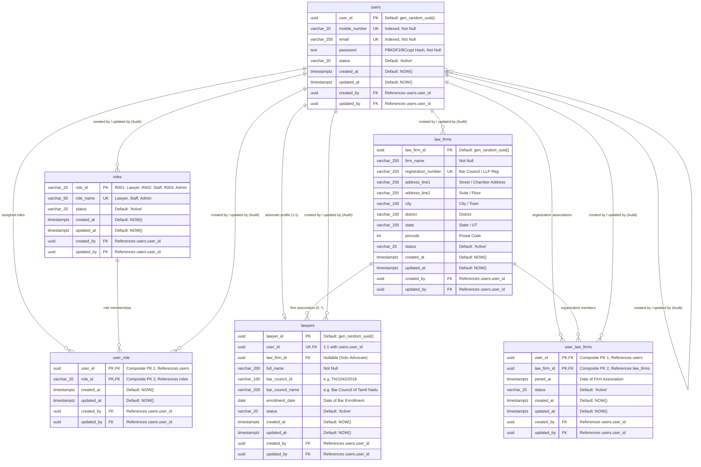

# CaseTracker — Database Architecture & ER Diagram

> **Document Version:** 1.0  
> **Database Engine:** PostgreSQL 16+ (Neon Cloud Serverless with PgBouncer Pooling)  
> **Tenancy Strategy:** Shared-Table Architecture with Logical Organization Isolation  
> **Parent Documentation:** [Documentation Center](../README.md)

---

## 1. Tenancy Strategy & Architecture

CaseTracker utilizes a **Shared-Table, Shared-Schema Architecture** in PostgreSQL.

* All organizations (law firms, independent advocates, and legal staff) share the same underlying schema tables (`users`, `lawyers`, `law_firms`, etc.).
* Logical tenant isolation is enforced at the **application and query layer** using foreign keys (`law_firm_id`, `created_by`, `user_id`).
* **Cloud Infrastructure**: Hosted on **Neon.tech Serverless PostgreSQL** using pooled connection endpoints (`ep-dry-silence-aepi0j4w-pooler.c-2.us-east-2.aws.neon.tech`) with `SSL Mode=VerifyFull; Channel Binding=Require;` for secure TLS transmission.
* **Benefits**:
  * **Zero Idle Cost & Fast Scaling**: Serverless compute automatically scales down during off-peak hours and bursts during busy court hours.
  * **Unified Migrations**: EF Core migrations apply instantaneously across all tenants in a single schema update.
  * **Optimized Connection Pooling**: PgBouncer integration handles thousands of concurrent short-lived API requests without exhausting database thread limits.

---

## 2. Entity-Relationship Diagram (ERD)

The diagram below reflects the production database schema configured via `ApplicationDbContext`:

---

## 3. Relationships & Cascade Deletion Rules

| Parent Table | Child Table | Relationship | Foreign Key | EF Core Delete Behavior | Rationale |
| :--- | :--- | :---: | :--- | :--- | :--- |
| `users` | `lawyers` | 1 &rarr; 0..1 | `lawyers.user_id` | `Cascade` | Deleting a user account cleans up the advocate profile. |
| `law_firms` | `lawyers` | 1 &rarr; 0..* | `lawyers.law_firm_id` | `SetNull` | Disbanding a law firm keeps lawyers intact as independent advocates. |
| `users` | `user_role` | 1 &rarr; 0..* | `user_role.user_id` | `Cascade` | Deleting a user cleans up role associations. |
| `roles` | `user_role` | 1 &rarr; 0..* | `user_role.role_id` | `Restrict` | System roles cannot be deleted while assigned to users. |
| `users` | `user_law_firms`| 1 &rarr; 0..* | `user_law_firms.user_id` | `Cascade` | Deleting a user cleans up firm memberships. |
| `law_firms` | `user_law_firms`| 1 &rarr; 0..* | `user_law_firms.law_firm_id` | `Cascade` | Deleting a firm cleans up membership records. |
| `users` (Audit) | *All Tables* | 1 &rarr; 0..* | `created_by`, `updated_by` | `Restrict` | Prevents deleting audit trails for compliance. |

---

## 4. Performance Indexes & Constraints

### Unique Constraints (`UX`)
* `ux_users_mobile_number`: Guarantees mobile number uniqueness across the system.
* `ux_users_email`: Guarantees email address uniqueness across the system.
* `ux_roles_role_name`: Guarantees uniqueness of system role names.
* `ux_law_firms_registration_number`: Prevents duplicate firm registration numbers.

### Performance Indexes (`IX`)
* `ix_lawyers_user_id`: Enforces fast 1:1 lookups between user logins and lawyer profiles.
* `ix_lawyers_bar_council_id`: Fast advocate search by Bar Council ID.
* `ix_lawyers_law_firm_id`: Fast retrieval of all advocates under a specific firm.
* `ix_user_law_firms_law_firm_id`: Fast lookup of law firm rosters.

---

## 5. Seed Data

Initialized during database migration:
* **`R001`**: `Lawyer` — Default role for independent advocates.
* **`R002`**: `Staff` — Legal clerks, paralegals, and chamber assistants.
* **`R003`**: `Admin` — Law firm partners and system administrators.

---

## 6. Related Documents
* **[Data Dictionary](./02_data_dictionary.md)** — Detailed field specifications and constraints.
* **[Database Migrations Guide](../development/02_database_migrations.md)** — EF Core migration instructions.
