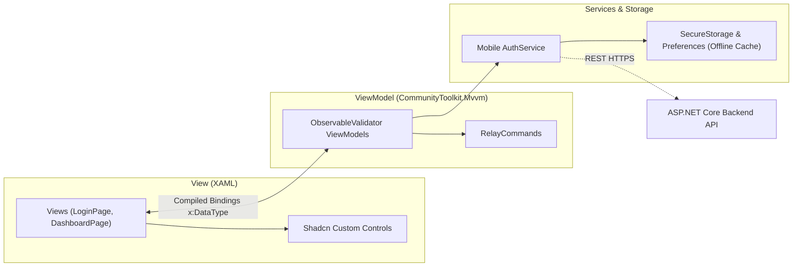

# CaseTracker — Mobile App Architecture (.NET MAUI)

> **Framework:** .NET MAUI (.NET 10)  
> **MVVM Library:** CommunityToolkit.Mvvm (v8.4.0)  
> **Platforms:** Android, iOS, Windows 10/11, MacCatalyst  
> **Parent Documentation:** [Documentation Center](../README.md)

---

## 1. Architecture & Design Pattern

`CaseTrackerMobile` implements the **Model-View-ViewModel (MVVM)** pattern. Business entities and DTOs are mapped directly to ViewModels that drive declarative XAML pages.



---

## 2. Shadcn Custom Design System

To avoid native platform visual inconsistencies (such as underlines on Android entries or platform borders on iOS/Windows), a custom design system was created under `CaseTrackerMobile/Controls`:

### 2.1 Zero Platform Underlines
Configured globally in [`MauiProgram.cs`](file:///D:/CaseTracker/Backend/CaseTrackerMobile/MauiProgram.cs):
* **Android**: Sets native view background to `null` (transparent).
* **iOS / MacCatalyst**: Sets `BorderStyle = UITextBorderStyle.None`.
* **Windows**: Sets `BorderThickness = 0`.

### 2.2 Reusable Custom Controls
* **`ShadcnEntry`**:
  * Clean rounded border (`StrokeShape="RoundRectangle 8"`).
  * Right-side action slot (e.g. password visibility toggle).
  * Real-time inline red error caption (`#EF4444`) bound to validation state.
* **`ShadcnButton`**:
  * Primary color styling (`#113979`).
  * Spring touch-scale animation (`ScaleTo(0.96, 50)` on touch down).
  * Built-in `ActivityIndicator` when `IsLoading="True"`.
* **`ShadcnCard`**: Grouping container with subtle borders and card elevation.
* **`ShadcnBadge`**: Status badge supporting `Default`, `Secondary`, `Outline`, and `Destructive` variants.
* **`ShadcnMetricCard`**: Dashboard KPI card displaying primary metric value, title, trend badge, and colored icon.

---

## 3. Real-Time Keystroke Validation

ViewModels inherit from **`ObservableValidator`** from `CommunityToolkit.Mvvm.ComponentModel`:
* Validation attributes (`[Required]`, `[RegularExpression]`, `[MinLength]`) trigger immediately on property modification.
* Custom error messages render automatically in the UI without freezing the main thread.

```csharp
[ObservableProperty]
[NotifyDataErrorInfo]
[Required(ErrorMessage = "Mobile number is required.")]
[RegularExpression(@"^[0-9]{10}$", ErrorMessage = "Enter a valid 10-digit mobile number.")]
private string _mobile = string.Empty;
```

---

## 4. Shell Navigation Lifecycle

Configured in [`AppShell.xaml`](file:///D:/CaseTracker/Backend/CaseTrackerMobile/AppShell.xaml):

```text
StartupSplashPage (Route: "StartupSplash")
      ↓ (Auto-navigate after delay / token check)
  LoginPage (Route: "Login") <=======> RegisterPage (Route: "Register")
      ↓ (Successful Auth)
DashboardPage (Route: "Dashboard")
```

Navigation uses standard absolute Shell routes:
* To Register: `Shell.Current.GoToAsync("//Register")`
* To Dashboard: `Shell.Current.GoToAsync("//Dashboard")`
* To Logout: `Shell.Current.GoToAsync("//Login")`

---

## 5. Offline-First & Standalone Fallback

In court complexes with weak cellular reception, [`AuthService.cs`](file:///D:/CaseTracker/Backend/CaseTrackerMobile/Services/AuthService.cs) handles network drops gracefully:
1. First attempts live HTTPS connection to the Web API backend (`https://10.0.2.2:7232/` on Android emulator or `https://localhost:7232/` on Windows).
2. If backend is unreachable or in standalone testing mode:
   - Validates against pre-seeded test advocate credentials (`9876543210` / `Password123!`).
   - Checks local accounts stored securely in device `Preferences`.
   - Stores session tokens in `SecureStorage` to allow uninterrupted workflow testing.

