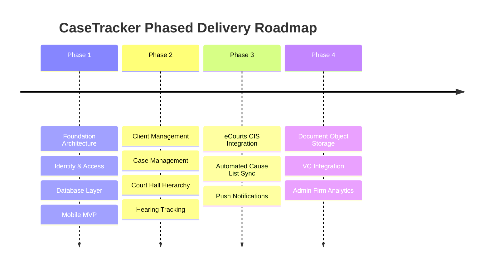

# CaseTracker — Project Scope & Release Boundaries

> **Document Version:** 1.1  
> **Status:** Active Reference  
> **Parent Documentation:** [Documentation Center](../README.md)

---

## 1. Purpose of Scope Definition

This document outlines the explicit boundaries of the **CaseTracker** project. It delineates:
* Capabilities included in current milestones.
* Capabilities deferred to future phases.
* Items explicitly categorized as **Out of Scope**.
* Governance guidelines for evaluating feature change requests.

---

## 2. Phased Roadmap & Release Boundaries

Development is executed incrementally across four distinct phases:

### Phase 1 — Foundation (Current Baseline)
* **Goal**: Establish the production-grade architectural and security foundation.
* **Scope**:
  * Solution layout using Clean Architecture (.NET 10).
  * Database schema for Users, Roles, Lawyers, Law Firms, and Relationships in PostgreSQL.
  * Stateless JWT authentication with PBKDF2/BCrypt hashing.
  * Centralized Exception Handling Middleware for normalized JSON error responses.
  * .NET MAUI mobile foundation with Shadcn design system and offline test fallback.

### Phase 2 — Core Application (Immediate Target)
* **Goal**: Enable end-to-end management of clients, court cases, and hearing schedules.
* **Scope**:
  * **Client Management**: Create, update, search, and list clients (individuals & corporate entities).
  * **Case Management**: Case registration, CNR number indexing, case type classification, stage tracking, and client matter associations.
  * **Court Metadata**: Geographic court hierarchy (State &rarr; District &rarr; Complex &rarr; Court Hall).
  * **Hearings Module**: Daily cause-list scheduling, board numbers, and hearing history logs.

### Phase 3 — External Integrations & Notifications
* **Goal**: Connect with official judicial sources to automate manual docketing.
* **Scope**:
  * **eCourts Sync Engine**: CNR search, automated case history updates, and cause-list sync.
  * **Push Notification Service**: Firebase Cloud Messaging (FCM) / APNS for daily hearing alerts and cause-list updates.
  * **Background Workers**: Periodic background schedulers for automated overnight court scraping.

### Phase 4 — Advanced Capabilities
* **Goal**: Comprehensive digital law-office enablement.
* **Scope**:
  * **Document Cloud Storage**: S3-compatible object storage (AWS S3 / Cloudflare R2 / MinIO) for legal PDFs.
  * **Virtual Court Video Conferencing**: Integration of VC links (Cisco Webex / NIC VC) directly with hearing items.
  * **Firm Analytics & Billing**: Caseload distribution, billable court appearances, and retainer management.

---

## 3. Boundary Definitions

| Dimension | In-Scope (Phase 1–2) | Future Scope (Phase 3–4) | Strictly Out of Scope |
| :--- | :--- | :--- | :--- |
| **Geographic** | Tamil Nadu & Puducherry | Pan-India Courts & Tribunals | International Jurisdictions |
| **Platforms** | Android, iOS, Windows, ASP.NET Core API | Web Admin Portal (React / Blazor) | Desktop Linux Native |
| **Database** | PostgreSQL (Shared Schema) | Multi-Region Read Replicas | NoSQL / Document-only Primary Store |
| **Integrations** | eCourts Public Case Portal | WhatsApp Notification Gateway | Replacing Government Court Portals |
| **AI / Legal** | Automated docket sync | Legal research search summaries | Automated legal opinion / advice |

---

## 4. Scope Governance & Change Management

Before adding a new feature or technical capability to the active sprint:
1. **Scope Check**: Is the requirement part of the active Phase milestone?
2. **Impact Assessment**: Does it change existing database schemas, API contracts, or mobile UI workflows?
3. **Architecture Review**: If an architectural change is needed, an **Architecture Decision Record (ADR)** must be drafted before code is merged.

