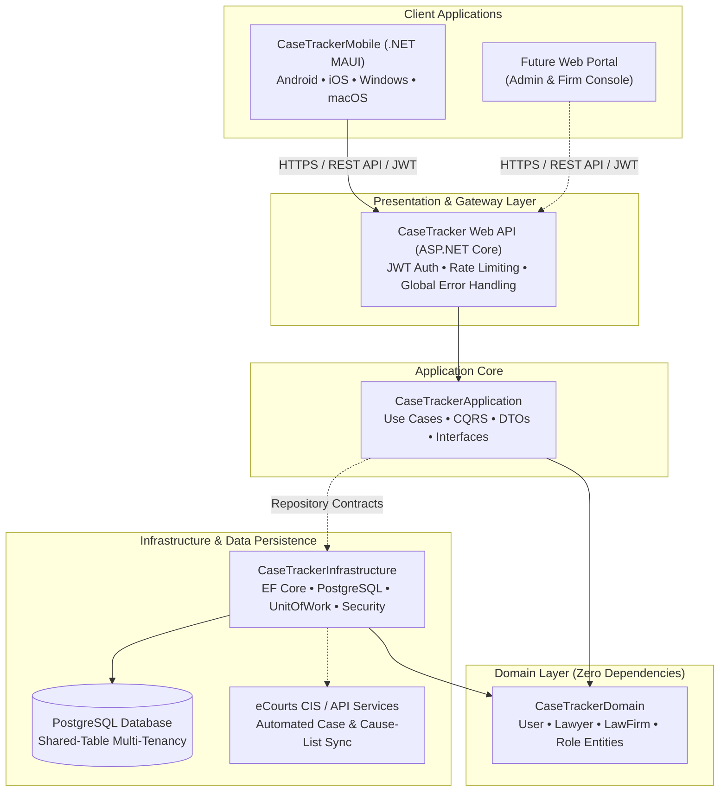

# CaseTracker — Legal Case Management Platform

[](https://dotnet.microsoft.com/)
[](https://www.postgresql.org/)
[](https://dotnet.microsoft.com/apps/maui)
[]()
[]()

**CaseTracker** is a legal case management system designed specifically for advocates, law firms, and legal staff in India. Starting with focused workflows for courts across **Tamil Nadu and Puducherry**, the system is engineered to scale nationwide across the Indian judicial system with integrated **eCourts synchronization**, hearing alerts, cause-list tracking, and client matter management.

---

## 🏛️ System Architecture Overview

The solution follows **Clean Architecture** principles, maintaining strict separation between domain models, application business logic, data persistence, API endpoints, and client apps.



---

## 🗂️ Solution Structure

```text
CaseTracker/
├── CaseTracker/                    # ASP.NET Core REST Web API (Controllers, Middleware, DI)
├── CaseTrackerApplication/         # Application Core (DTOs, Business Logic, Interfaces)
├── CaseTrackerDomain/              # Core Domain Entities & Business Rules
├── CaseTrackerInfrastructure/      # EF Core, PostgreSQL Mappings, Repositories, JWT, Security
├── CaseTrackerMobile/              # Cross-Platform Client App (.NET MAUI + Shadcn Design System)
└── Documents/                      # Comprehensive Architecture & Product Documentation
```

---

## 🚀 Key Features

* **Advocate & Law Firm Profiles**: Complete onboarding with Bar Council enrollment numbers, firm associations, and role-based permissions.
* **Smart Authentication**: Secure mobile number & password authentication with JWT Bearer tokens and offline mobile client fallback.
* **Modern Mobile Experience**: Built with .NET MAUI featuring a zero-lag **Shadcn-inspired design system** (`ShadcnEntry`, `ShadcnButton`, `ShadcnCard`, `ShadcnMetricCard`, `ShadcnBadge`).
* **Real-time Form Validation**: Immediate keystroke validation powered by `CommunityToolkit.Mvvm.ComponentModel.ObservableValidator`.
* **eCourts Integration (Roadmap)**: Automated retrieval of case status, cause lists, orders, and hearing dates from the Indian eCourts portal.
* **Multi-Tenancy**: Shared-table architecture with strict logical organizational data isolation.

---

## 🛠️ Technology Stack

| Component | Technology | Description |
| :--- | :--- | :--- |
| **Runtime & SDK** | .NET 10 | High-performance C# runtime |
| **API Framework** | ASP.NET Core Web API | RESTful web services |
| **ORM** | Entity Framework Core 8+ | Code-first database migrations & LINQ |
| **Database** | PostgreSQL | Robust ACID relational storage |
| **Mobile Client** | .NET MAUI | Native cross-platform app (Android, iOS, Windows, MacCatalyst) |
| **MVVM Framework** | CommunityToolkit.Mvvm | Clean MVVM architecture with code generation |
| **Authentication** | JWT & PBKDF2/BCrypt | Stateless bearer tokens and secure credential hashing |
| **API Docs** | Swagger / OpenAPI | Interactive endpoint testing and contract documentation |

---

## ⚡ Quick Start

### Prerequisites
* [.NET 10 SDK](https://dotnet.microsoft.com/)
* [PostgreSQL 16+](https://www.postgresql.org/) running locally on port 5432
* [Visual Studio 2022](https://visualstudio.microsoft.com/) (with *.NET MAUI* and *ASP.NET and web development* workloads) or VS Code

### 1. Configure the Database
Update connection string in `CaseTracker/appsettings.Development.json`:
```json
"ConnectionStrings": {
  "DefaultConnection": "Host=localhost;Port=5432;Database=CaseTracker;Username=postgres;Password=your_password;"
}
```

### 2. Apply Migrations
```powershell
dotnet ef database update --project CaseTrackerInfrastructure --startup-project CaseTracker
```

### 3. Run the Backend API
```powershell
dotnet run --project CaseTracker
```
The API Swagger UI will be available at: `https://localhost:7232/swagger`

### 4. Run the Mobile App
Open `CaseTracker.slnx` in Visual Studio and set `CaseTrackerMobile` as startup project, selecting your target device (Android Emulator, Windows Machine, or iOS Simulator).

> **Pre-configured Test Advocate Account:**
> - **Mobile**: `9876543210`
> - **Password**: `Password123!`
> - **Advocate**: Adv. R. Sundaram (TN/1042/2018)

---

## 📚 Documentation Index

Comprehensive documentation is organized under the [`Documents/`](file:///D:/CaseTracker/Backend/Documents) directory:

* 📖 **[Product Vision & Scope](file:///D:/CaseTracker/Backend/Documents/product/)**: Product goals, target users, and release scope.
* 🏛️ **[System Architecture](file:///D:/CaseTracker/Backend/Documents/architecture/)**: Clean Architecture design, ER diagrams, and ADRs.
* 💻 **[Developer Guides](file:///D:/CaseTracker/Backend/Documents/development/)**: Machine onboarding, database migrations, and coding standards.
* 🔌 **[API Documentation](file:///D:/CaseTracker/Backend/Documents/api/)**: Auth handshake, endpoints, and DTO specifications.
* 📱 **[Mobile App Guide](file:///D:/CaseTracker/Backend/Documents/mobile/)**: MAUI MVVM patterns, navigation, and Shadcn design system.
* 📝 **[Changelog](file:///D:/CaseTracker/Backend/Documents/changelog/)**: Project version history and change logs.

---

## 📄 License
Internal proprietary software for CaseTracker legal ecosystem.

