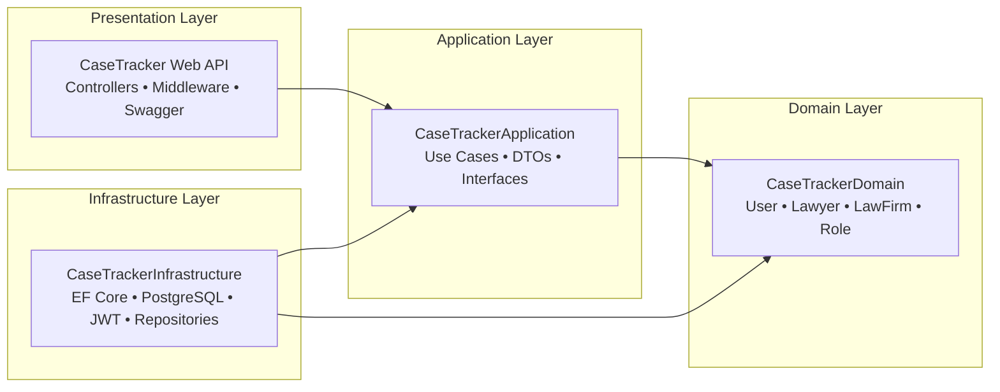

# CaseTracker — Legal Practice Management Platform

[](https://dotnet.microsoft.com/)
[](https://neon.tech/)
[]()
[](https://github.com/Our-Products/CaseTracker/actions)
[](http://zylocorp.runasp.net/swagger/index.html)
[](http://zylocorp.runasp.net/api/version)

**CaseTracker** is an enterprise-grade legal practice management platform engineered for advocates, law chambers, and legal staff across India. Built on **.NET 10** with strict **Clean Architecture**, the platform provides advocate profiling, role-based organizational access, matter management, and automated continuous deployment to cloud IIS hosting.

---

## 🌐 Live Service & Production Links

| Resource | Direct Link | Purpose |
| :--- | :--- | :--- |
| **Interactive Swagger API** | [zylocorp.runasp.net/swagger](http://zylocorp.runasp.net/swagger/index.html) | OpenAPI 3.0 documentation & live endpoint testing |
| **Health & Version Check** | [zylocorp.runasp.net/api/version](http://zylocorp.runasp.net/api/version) | Production liveness & deployment metadata |
| **API Base Gateway** | `http://zylocorp.runasp.net/api` | REST API service root |

---

## 🏛️ Architecture at a Glance

CaseTracker maintains strict separation of concerns via **Clean Architecture**. Dependencies point inwards; business rules and domain entities remain completely independent of frameworks, databases, and UI layers.



---

## ⚡ 3-Step Quick Start

### 1. Clone & Configure
```bash
git clone https://github.com/Our-Products/CaseTracker.git
cd CaseTracker
```
Ensure database connection settings are configured in `CaseTracker/appsettings.json` (or `.env`).

### 2. Build Solution
```bash
dotnet build CaseTracker.slnx --configuration Release
```

### 3. Run Locally
```bash
dotnet run --project CaseTracker/CaseTracker.csproj
```
Access local Swagger at: `https://localhost:7198/swagger`

---

## 📚 Master Documentation Hub

All in-depth architectural specifications, database schemas, API references, and DevOps guides are maintained in the [`Documents/`](./Documents/README.md) directory.

| Documentation Area | Description | Link |
| :--- | :--- | :---: |
| **System Architecture** | Clean Architecture layer boundaries, dependency rules, and request execution pipeline | [Read Guide](./Documents/architecture/01_system_architecture.md) |
| **Database Architecture & ERD** | Shared-table multi-tenancy, complete Mermaid ERD, and Neon PostgreSQL setup | [Read Guide](./Documents/database/01_database_design_and_erd.md) |
| **Data Dictionary** | Column-by-column specifications, constraints, data types, and cascade rules | [Read Guide](./Documents/database/02_data_dictionary.md) |
| **REST API Reference** | Complete catalog of all endpoints, request/response JSON schemas, and status codes | [Read Guide](./Documents/api/01_api_reference.md) |
| **Authentication & Security** | JWT Bearer handshake, claim structure, and PBKDF2/BCrypt hashing specifications | [Read Guide](./Documents/api/authentication_flow.md) |
| **CI/CD Automated Deployment** | GitHub Actions (`ci.yml` & `cd.yml`), MonsterASP WebDeploy, and secrets setup | [Read Guide](./Documents/ci/01_ci_cd_pipeline.md) |
| **Deployment Troubleshooting** | Solutions for 401 Unauthorized, PowerShell escaping, and locked DLL resolution | [Read Guide](./Documents/ci/02_troubleshooting.md) |
| **Developer Onboarding** | Step-by-step local machine setup, tools, and running tests | [Read Guide](./Documents/development/01_getting_started.md) |
| **Database Migrations** | EF Core schema migration workflow, CLI commands, and rollback guides | [Read Guide](./Documents/development/02_database_migrations.md) |
| **Coding Standards** | C# 12 / .NET 10 conventions, DTO patterns, and error handling guidelines | [Read Guide](./Documents/development/03_coding_standards.md) |
| **Product Vision & Scope** | Target advocate personas, functional requirements, and product roadmap | [Read Guide](./Documents/product/01_product_vision.md) |
| **eCourts Integration** | Indian judicial eCourts API specifications, CNR numbers, and cause-list sync | [Read Guide](./Documents/ecourt/README.md) |

---

## 🛠️ Technology Stack

| Layer | Technology | Version | Purpose |
| :--- | :--- | :---: | :--- |
| **Runtime** | .NET | 10.0 | High-performance C# runtime & SDK |
| **Web Framework** | ASP.NET Core Web API | 10.0 | RESTful HTTP API services |
| **ORM** | Entity Framework Core | 8.0+ / 10.0 | Code-first migrations & LINQ data access |
| **Database** | PostgreSQL (Neon Cloud) | 16+ | Serverless connection-pooled ACID storage |
| **Security** | JWT & PBKDF2/BCrypt | - | Stateless token auth & cryptographic password hashing |
| **Documentation** | Swagger / OpenAPI | 6.5+ | Interactive endpoint contracts & testing |
| **CI/CD** | GitHub Actions | v4 | Automated pull request validation and deployment |
| **Hosting** | MonsterASP.net (IIS) | 10.0 | Production Windows Server WebDeploy hosting |

---

## ⚖️ License
Copyright © 2026 CaseTracker Systems. All Rights Reserved.
