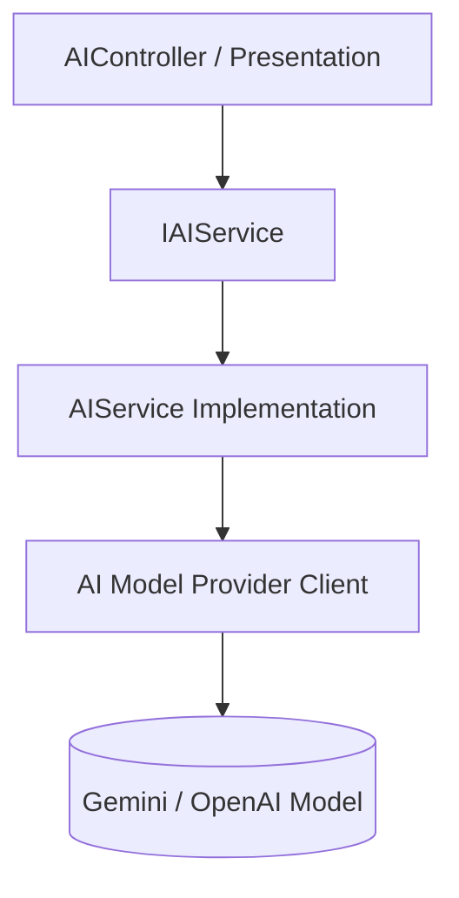

# CaseTracker AI Architecture

## Overview
CaseTracker provides an extensible AI foundation service designed to support future legal research, automated case summaries, and query assistants without violating Clean Architecture or creating unmonitored database access.

## Current Architecture

## Architectural Guardrails (Phase 12 Compliance)
1. **Strict Decoupling**: AI services remain completely isolated from eCourts background synchronization and raw database persistence.
2. **No Direct Database Access**: The AI model has NO direct read or write access to PostgreSQL tables.
3. **No Premature RAG / Vector Stores**: In accordance with project requirements, RAG pipelines and vector databases are NOT introduced yet.
4. **Controlled Tool Calling (Future Expansion)**: Future AI tools will access application services through explicit, authorized interfaces:
   * `GetLawFirmCount()`
   * `GetLawyerCount()`
   * `GetCaseCount()`
   * `GetUpcomingHearings()`
   * `GetCaseDetails(caseId)`
5. **Security & Data Privacy**: Client KYC data, personal mobile numbers, and confidential witness details are never sent in AI system prompts.
