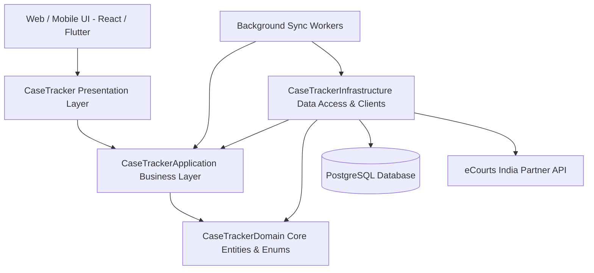

# CaseTracker Backend Architecture

## Overview
CaseTracker is an enterprise legal practice management platform built on **ASP.NET Core (.NET 10)** following strict **Clean Architecture** principles. It provides high-performance, cost-controlled case lifecycle management, automated court hearing synchronizations, client communications, role-based security, and extensible AI assistant capabilities.

## Layer Responsibilities

### 1. CaseTrackerDomain (`CaseTrackerDomain`)
* The core, dependency-free layer containing enterprise domain models, aggregates, entity relationships, and domain enums.
* **Entities**:
  * `Case`, `Client`, `CaseClient`, `CaseHearing`, `CaseOrder`, `CaseDocument`, `CaseLawyer`, `CaseLawyerRole`.
  * `State`, `District`, `CourtComplex`, `CourtType`, `Court` (court hierarchy master entities).
  * `User`, `Role`, `LawFirm`, `Lawyer`, `Zone`.
  * `ECourtSyncLog`, `ECourtApiLog` (observability & credit audit entities).
* **Guarantees**: Zero dependencies on EF Core, ASP.NET Core, or third-party web frameworks.

### 2. CaseTrackerApplication (`CaseTrackerApplication`)
* Orchestrates business rules, use-cases, validation, and data transfer.
* **DTOs**: Strongly typed, sanitized request/response contracts (`CaseDtos`, `ClientDtos`, `HearingDtos`, `CourtMasterDtos`, `ECourtDtos`).
* **Interfaces**:
  * Core repositories: `ICaseRepository`, `IClientRepository`, `IHearingRepository`, `ICourtRepository`, `IECourtApiLogRepository`.
  * Business services: `ICaseService`, `IClientService`, `IHearingService`, `ICourtMasterService`, `IECourtSyncService`.
  * External integrations: `IECourtClient`.
* **Services**:
  * `CaseService`: Enforces law firm tenancy, validations, and case lifecycle transitions.
  * `ClientService`: Manages client profiles, KYC, contact references, and case linkages.
  * `HearingService`: Manages scheduled dates, court chambers, judge assignments, and next-date updates.
  * `CourtMasterService`: Upserts State, District, Complex, and Court master data with change detection.
  * `ECourtSyncService`: Implements cost-sensitive, rate-limited, batch synchronization for pending cases.

### 3. CaseTrackerInfrastructure (`CaseTrackerInfrastructure`)
* Handles all persistence, database contexts, external HTTP integrations, and background hosted services.
* **Persistence**:
  * `ApplicationDbContext`: EF Core 10 PostgreSQL context with snake_case table naming conventions, composite indexes, soft deletes, and audit tracking.
  * Concrete repositories: `CaseRepository`, `ClientRepository`, `HearingRepository`, `CourtRepository`, `ECourtApiLogRepository`.
* **External Integrations**:
  * `ECourtClient`: Secure HTTP client targeting eCourts India Partner APIs with exponential backoff on HTTP 429 (`Retry-After`), credit tracking, and automated audit logging.
* **Background Workers**:
  * `CourtMasterSyncWorker`: Runs on a configurable interval (default: monthly) to sync Tamil Nadu and Puducherry court structures.
  * `CaseStatusSyncWorker`: Runs on a scheduled interval (default: daily) to process pending cases in controlled batches.

### 4. CaseTracker (`CaseTracker` Presentation / Web API)
* REST API exposing versioned endpoints secured by JWT Bearer authentication.
* Thin controllers returning standardized `ApiResponse<T>` envelopes (`Success`, `Message`, `Data`, `Errors`, `StatusCode`).
* Global exception handling, correlation ID logging, and rate limiting middleware.
