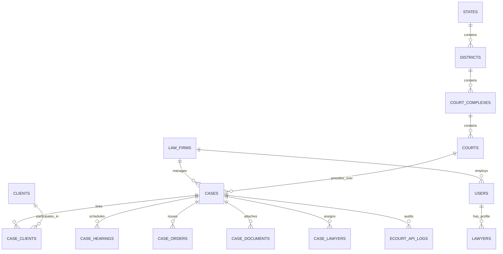

# CaseTracker Database Architecture & Schema

## Database Engine
* **PostgreSQL** (Hosted on Neon Serverless PostgreSQL with PgBouncer connection pooling).
* **ORM**: Entity Framework Core 10 (`Npgsql.EntityFrameworkCore.PostgreSQL`).
* **Conventions**: Snake_case table names and column names, explicit foreign keys, non-destructive migrations.

## Entity Relationship Overview

## Key Tables & Indices

### 1. `cases`
* Primary Key: `case_id` (UUID).
* Unique Index: `cnr_number` (WHERE cnr_number IS NOT NULL).
* Indices:
  * `law_firm_id`
  * `court_id`
  * `(status, last_synced_at)` for fast query of eligible sync candidates.
* Synchronization Fields:
  * `last_synced_at` (TIMESTAMPTZ)
  * `last_successful_sync_at` (TIMESTAMPTZ)
  * `last_sync_attempt_at` (TIMESTAMPTZ)
  * `sync_status` (VARCHAR 50)
  * `sync_error` (TEXT)

### 2. `clients` & `case_clients`
* Composite Primary Key on `case_clients`: `(case_id, client_id)`.
* Party Types: `Petitioner`, `Respondent`, `Applicant`, `Defendant`.

### 3. `case_hearings`
* Primary Key: `hearing_id` (UUID).
* Foreign Key: `case_id` ON DELETE CASCADE.
* Indices: `(case_id, hearing_date)`.

### 4. Court Hierarchy Tables
* `states`: `(state_id, state_code UNIQUE, state_name)`.
* `districts`: `(district_id, state_id, district_code, district_name)`.
* `court_complexes`: `(court_complex_id, district_id, complex_code, complex_name)`.
* `courts`: `(court_id, court_complex_id, court_code, court_name, judge_name)`.

### 5. `ecourt_api_logs`
* Audit trail for every eCourts partner API call.
* Fields: `log_id`, `endpoint`, `http_method`, `request_payload`, `status_code`, `response_payload`, `credits_deducted`, `latency_ms`, `is_success`, `error_message`, `created_at`.
* Index: `(created_at, is_success)`.
