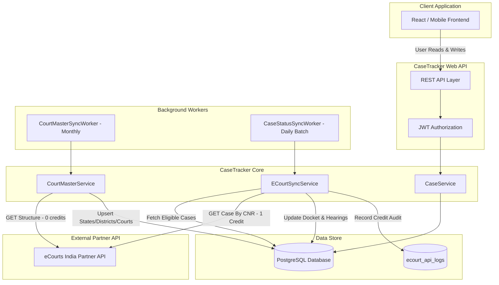

# eCourts Integration Architecture

## Architectural Principles
1. **Cost-Sensitive Gateway**: Every API call to eCourts India Partner API (`https://webapi.ecourtsindia.com`) incurs credit consumption for case lookups and dockets. Master data queries (states, districts, court complexes) are 0 credits.
2. **Local Database as Source of Truth**: User-facing web and mobile applications NEVER query eCourts synchronously on page loads or detail views. All read traffic hits PostgreSQL.
3. **Asynchronous Background Ingestion**: Data enters CaseTracker via scheduled workers (`CourtMasterSyncWorker`, `CaseStatusSyncWorker`) or audited administrator-triggered jobs.

## Partner API Integration Details
* **Base URL**: `https://webapi.ecourtsindia.com`
* **Authorization Header**: `X-API-KEY: {ECourts:ApiKey}`
* **Rate Limits**: 10 requests per second burst, backed by HTTP 429 response handling with `Retry-After` header extraction and exponential backoff.
* **Timeout**: Configured to 30 seconds with transient fault handling.
