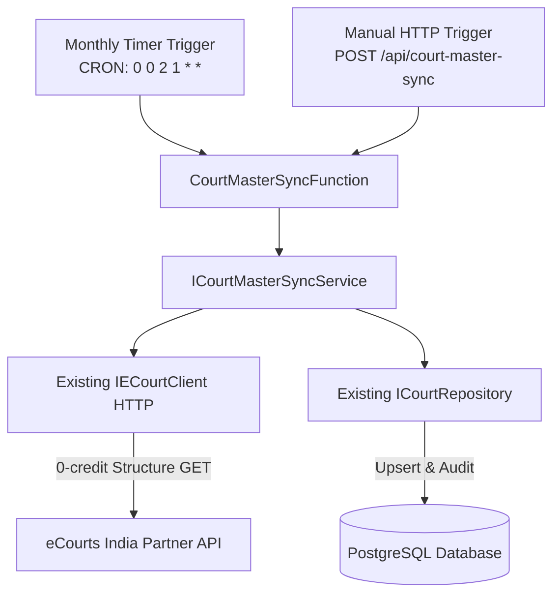
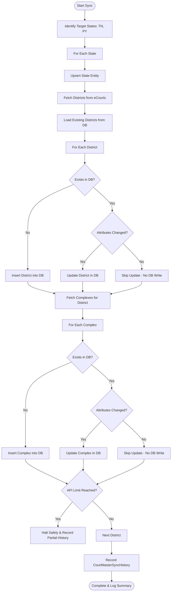

# CaseTracker Azure Function: Court Master Synchronization

## 1. Purpose & Scope
The **`CourtMasterSyncFunction`** is a dedicated, scheduled Azure Function responsible for synchronizing India's court hierarchy master data:

$$\text{State} \longrightarrow \text{District} \longrightarrow \text{Court Complex}$$

### Key Operating Directives:
* **Master Data Only**: Synchronizes States, Districts, and Court Complexes. Does **NOT** synchronize individual cases, case status, or cause lists.
* **Initial Coverage**: Focuses strictly on **Tamil Nadu (`TN`)** and **Puducherry (`PY`)**.
* **Zero Credit Cost**: Utilizes only free court structure endpoints (`0 credits`).
* **Schedule**: Runs **once per month** (e.g. `0 0 2 1 * *` - 1st of every month at 2:00 AM UTC).
* **Non-destructive & Idempotent**: Employs change-detection; updates existing records only when attributes have changed; skips identical records; marks obsolete entities inactive rather than hard-deleting them.

---

## 2. Architecture & Data Flow



### Layer Separation
1. **Azure Function App (`Agent/CaseTracker.Functions`)**:
   - Solution: `Agent/CaseTracker.Agent.slnx`
   - `CourtMasterSyncTimer`: Triggered monthly by Azure Functions timer runtime.
   - `CourtMasterSyncManual`: HTTP trigger for on-demand sync, integration testing, and operational administration.
   - Depends strictly on `ICourtMasterSyncService`. Contains minimal glue logic.
2. **Shared Application Layer (`CaseTrackerApplication`)**:
   - `ICourtMasterSyncService` / `CourtMasterSyncService`: Encapsulates business rules, batching, change-detection, API budget guards, and history recording.
3. **Shared Infrastructure Layer (`CaseTrackerInfrastructure`)**:
   - Reuses `IECourtClient` / `ECourtClient` (HTTP client with retry and backoff).
   - Reuses `ICourtRepository` / `CourtRepository` (EF Core queries, state/district/complex upserts, audit persistence).
4. **Shared Domain Layer (`CaseTrackerDomain`)**:
   - `State`, `District`, `CourtComplex`, `CourtMasterSyncHistory`.

---

## 3. eCourts India Partner Endpoints Used
The Function calls only the free court structure discovery APIs:

| Level | Endpoint | Credits | Method |
|---|---|---|---|
| **Districts** | `/api/partner/causelist/court-structure/states/{stateCode}/districts` | **0 Credits** | GET |
| **Court Complexes** | `/api/partner/causelist/court-structure/states/{stateCode}/districts/{districtCode}/complexes` | **0 Credits** | GET |

---

## 4. Database Entities & Relationships
The Function reuses existing CaseTracker domain models without duplication:

1. **`states` (`State.cs`)**:
   - Key: `state_id` (UUID). Unique: `state_code` (`TN`, `PY`). Name: `state_name`.
2. **`districts` (`District.cs`)**:
   - Key: `district_id` (UUID). Foreign Key: `state_id`. Unique combination: `(state_id, district_code)`.
3. **`court_complexes` (`CourtComplex.cs`)**:
   - Key: `court_complex_id` (UUID). Foreign Key: `district_id`.
4. **`court_master_sync_histories` (`CourtMasterSyncHistory.cs`)**:
   - Audit trail storing every execution:
     - `id` (UUID), `state` (VARCHAR 10), `started_at`, `completed_at`, `status` (`Completed`, `Partial`, `Failed`)
     - `records_read`, `records_inserted`, `records_updated`, `records_skipped`, `records_failed`
     - `api_requests`, `error_message`, `duration_ms`

---

## 5. Synchronization & Change Detection Algorithm



### Idempotency & Duplicate Prevention:
* Matches incoming records by stable external codes (`DistrictCode`, `CourtComplexCode`) and names.
* Running the job repeatedly with identical eCourts data produces **0 duplicate records** and **0 unnecessary updates**.

### Safe Deactivation:
* If `CourtMasterSync:DeactivateMissingEntities` is enabled, any district or complex no longer present upstream has its `status` updated to `Inactive`. **No records are ever hard-deleted.**

---

## 6. Cost Control & API Safeguards

1. **Strict Request Budget (`MaxApiRequestsPerRun`)**:
   - Default: `150 requests`.
   - Prevents infinite loops or runaway crawler activity. If reached, execution halts safely with `status: Partial`.
2. **Monthly Execution Cadence**:
   - Master court data changes rarely. Running once every 30 days is sufficient and prevents needless outbound calls.
3. **Controlled Retry Policy**:
   - Transient faults (HTTP 429 rate limit, 503, connection timeouts) retry up to 3 times with exponential backoff.
   - Non-transient faults (HTTP 401, 403, 404, bad requests) fail immediately without retrying.
4. **Per-District Persistence**:
   - Database changes are committed after each district. A network glitch on District 25 will **not** roll back Districts 1 through 24.

---

## 7. Configuration Reference

### `local.settings.json` (Local Development)
```json
{
  "IsEncrypted": false,
  "Values": {
    "AzureWebJobsStorage": "UseDevelopmentStorage=true",
    "FUNCTIONS_WORKER_RUNTIME": "dotnet-isolated",
    "ConnectionStrings:DefaultConnection": "Host=localhost;Port=5432;Database=casetracker;Username=postgres;Password=YourPassword;SslMode=Prefer;",
    "ECourts:BaseUrl": "https://webapi.ecourtsindia.com",
    "ECourts:ApiKey": "YOUR_ECOURTS_API_KEY",
    "CourtMasterSync:Schedule": "0 0 2 1 * *",
    "CourtMasterSync:Enabled": "true",
    "CourtMasterSync:MaxApiRequestsPerRun": "150",
    "CourtMasterSync:RetryCount": "3",
    "CourtMasterSync:RetryDelaySeconds": "2",
    "CourtMasterSync:DeactivateMissingEntities": "false"
  }
}
```

### Azure App Settings (Production)
| App Setting | Example Value | Description |
|---|---|---|
| `ConnectionStrings:DefaultConnection` | `Host=...;Database=casetracker;...` | PostgreSQL connection string |
| `ECourts:BaseUrl` | `https://webapi.ecourtsindia.com` | eCourts India Partner gateway |
| `ECourts:ApiKey` | `eci_live_...` | Live partner API key |
| `CourtMasterSync:Schedule` | `0 0 2 1 * *` | CRON schedule (1st of every month at 02:00 UTC) |
| `CourtMasterSync:Enabled` | `true` | Master switch to enable/disable job |
| `CourtMasterSync:MaxApiRequestsPerRun` | `150` | Maximum API requests allowed per execution |

---

## 8. Local Development & Execution

### Prerequisites:
1. .NET 10 SDK (`dotnet --version`)
2. Azure Functions Core Tools V4 (`func --version`)
3. Access to PostgreSQL database

### Run Locally:
```powershell
cd D:\ProjectApp\CaseTracker\Agent\CaseTracker.Functions
func start
```

### Triggering Manual Execution:
You can trigger the sync manually via HTTP without waiting for the monthly timer:
```bash
# Sync both Tamil Nadu and Puducherry
curl -X POST http://localhost:7071/api/court-master-sync

# Sync only Tamil Nadu
curl -X POST "http://localhost:7071/api/court-master-sync?state=TN"

# Sync only Puducherry with request cap
curl -X POST "http://localhost:7071/api/court-master-sync?state=PY&maxRequests=20"
```

### Verification in Database:
```sql
-- View execution history
SELECT state, started_at, completed_at, status, records_read, records_inserted, records_updated, records_skipped, api_requests, duration_ms
FROM court_master_sync_histories
ORDER BY started_at DESC;

-- View synced districts
SELECT d.district_code, d.district_name, s.state_code, d.status
FROM districts d
JOIN states s ON d.state_id = s.state_id
ORDER BY s.state_code, d.district_name;

-- View synced complexes
SELECT c.complex_code, c.complex_name, d.district_name
FROM court_complexes c
JOIN districts d ON c.district_id = d.district_id
LIMIT 20;
```

---

## 9. Azure Deployment Guide

### 1. Provision Azure Function App
* **OS**: Linux or Windows
* **Plan**: Consumption (Serverless) or Premium
* **Runtime**: .NET Isolated (v4)

### 2. Publish from CLI
```powershell
dotnet publish Agent\CaseTracker.Functions\CaseTracker.Functions.csproj -c Release -o ./publish
cd publish
func azure functionapp publish <YOUR_AZURE_FUNCTION_APP_NAME>
```

### 3. Monitoring & Alerts
* View real-time logs in **Application Insights** under `LogStream` or Kusto query:
  ```kusto
  traces
  | where message contains "Court Master Sync"
  | order by timestamp desc
  | limit 50
  ```
* Set up an Alert Rule if `status == 'Failed'` or if unhandled exceptions occur in `CourtMasterSyncFunction`.

---

## 10. Expanding to Additional States Later
To add coverage for other states (e.g. Karnataka `KA`, Kerala `KL`, Maharashtra `MH`):
1. In Azure Application Settings or `appsettings.json`, update `CourtMasterSync:TargetStates`:
   ```json
   "CourtMasterSync": {
     "TargetStates": ["TN", "PY", "KA", "KL"]
   }
   ```
2. No code modification or database schema changes are needed. The sync service and function will automatically iterate through the expanded state list on the next monthly execution.
